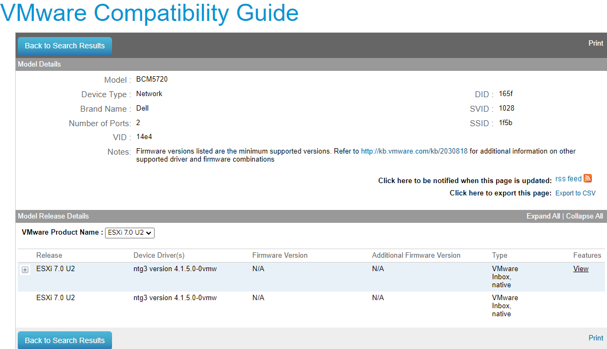

# Home Lab VMware NIC Information

This repository contains detailed information on the network interface cards (NICs) used in my VMware-based home lab, specifically within a PowerEdge R630 server. The purpose of this repository is to document the NIC models, their configurations, and compatibility with VMware ESXi versions, serving as a reference for setup and troubleshooting.

## Repository Contents

- `server_nic_info.txt`: A text file containing the detailed information about the NICs in the PowerEdge R630 server, including model, driver version, firmware version, and configuration settings as outputted by various ESXi CLI commands.

- `vmware_nic_hcl.png`: A screenshot from VMware's Hardware Compatibility List (HCL) page showing the compatibility of the NIC models with different ESXi versions.

## Server NIC Information Overview

The PowerEdge R630 server in this lab is equipped with four NICs, detailed as follows:

- **Model:** PowerEdge R630
- **Processor Type:** Intel(R) Xeon(R) CPU E5-2660 v3 @ 2.60GHz
- **Logical Processors:** 40
- **NICs:** 4

Each NIC's status, speed, duplex, MAC address, MTU, and description are captured from the ESXi CLI output, providing insight into the network setup and configuration within the VMware environment.

## NIC Compatibility with VMware ESXi

The NICs are verified against VMware's Hardware Compatibility List to ensure they are supported by VMware ESXi 7.0.2 build-18426014 (VMware ESXi 7.0 Update 2), the version currently running in the lab. This compatibility is crucial for optimal performance and stability of the virtualized environment.

For further details on the NIC configurations and settings, refer to the `server_nic_info.txt` file in this repository.

---

This documentation aims to assist in understanding the network interface setup of the PowerEdge R630 server running VMware ESXi and to provide a reference for similar setups or troubleshooting efforts.
